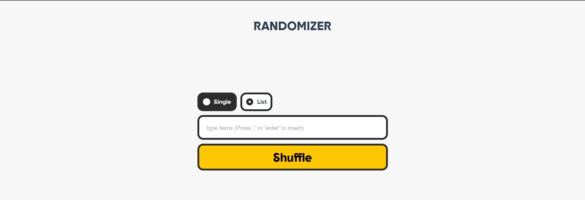

# Randomizer



Randomizer is a simple web application built with Vue.js that allows you to input a list of items, shuffle them, and get a random result. It provides two shuffle modes - Single and List, allowing you to generate a single random item or shuffle the entire list.

## Features

- Input items and press ',' or 'Enter' to insert them into the list.
- Choose between two shuffle modes: Single and List.
- Click on an item in the list to delete it.
- Enable/Disable background music while using the application.

## Demo

You can check out the live demo of the Randomizer here: [Demo Link](https://random.bouchikhi.com)

## Getting Started

Follow these steps to run the project locally:

1. Clone the repository to your local machine:

```bash
git clone https://github.com/your-username/randomizer.git
cd randomizer
```
2. Install the dependencies:
```bash
npm install
```

3. Run the development server:
```bash
npm run dev
```

4. Open your browser and navigate to http://localhost:5173 to access the Randomizer application.

## Usage

1. Select the shuffle mode by clicking on the radio buttons: Single or List.
2. Enter items into the input field and press ',' or 'Enter' to add them to the list.
3. To shuffle the items, click the "Shuffle" button.
4. To remove an item from the list, click on it.
5. If you wish to have some background music while using the app, check the "Music" checkbox.

## Contributing
Contributions are welcome! If you find any issues or have suggestions for improvement, please open an issue or submit a pull request.

## License
The Randomizer project is open-source and available under the MIT License. Feel free to use, modify, and distribute it as per the terms of the license.

## Credits
The Randomizer project was created by [devnart](https://bouchikhi.com). If you have any questions or inquiries, feel free to reach out.

Enjoy randomizing your lists with Randomizer! 🎲